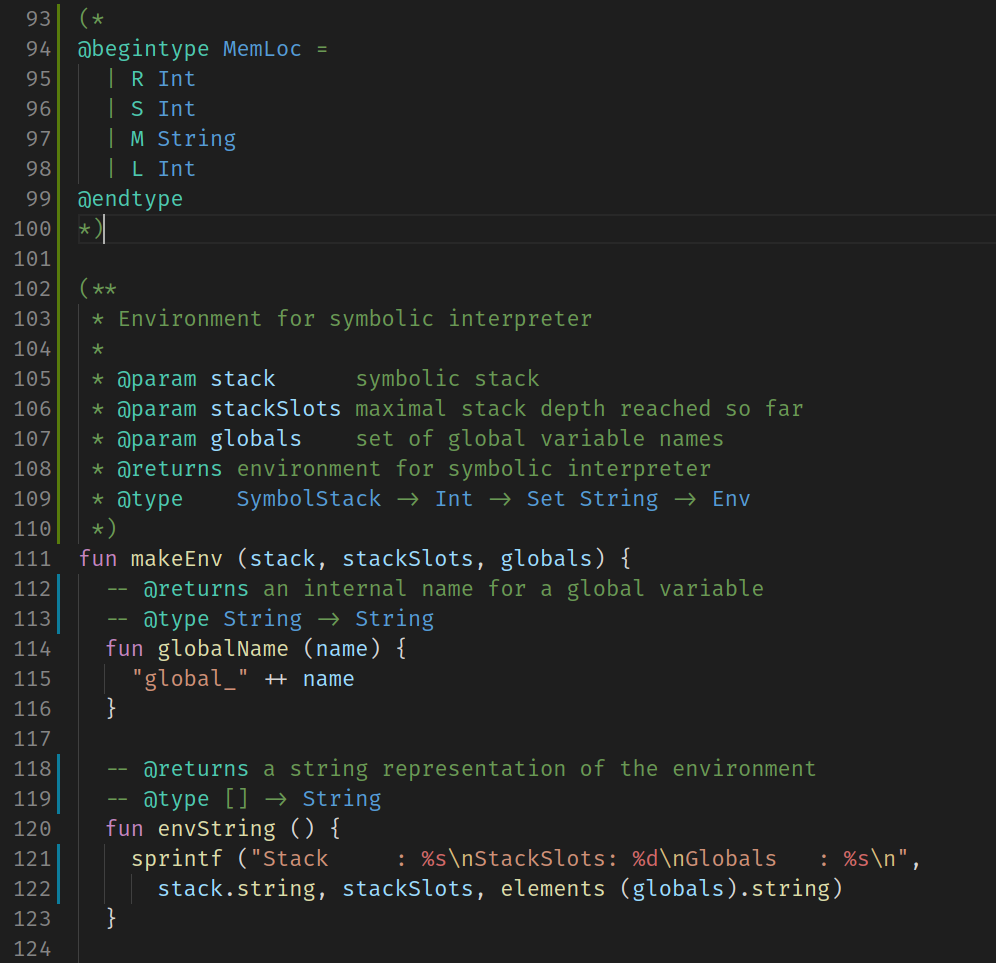

# Lama language

## How it looks like

## Description

Silly but brave VSCode plugin for the [Lama language](https://github.com/JetBrains-Research/Lama).

Provides:

- Basic syntax highlighting
- Documenting comments support:
  - `@param name` function parameter
  - `@returns` what function returns
  - `@type` *one line* type description in Haskell notation
  - `@begintype` ...  `@endtype` multiline type description in Haskell notation
- Some snippets for control structures and Stdlib functions
  - `case-of`
  - `if-then`
  - `fori`
  - `repeat`
  - `local-var`
  - `function`
  - `fold`, `iter`, `map` for different collections

## Demo

## Caution

Made in a garage in some hours just to put it work. Please, do not take it seriously c:
