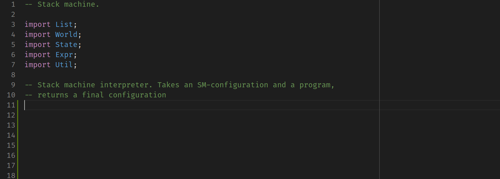

# Lama language

## Description

Silly but brave VSCode plugin for the [Lama language](https://github.com/JetBrains-Research/Lama).

Provides:

- Basic syntax highlighting
- Some snippets for control structures and Stdlib functions

## Demo

## Caution

Made in a garage in some hours just to put it work. Please, do not take it seriously c:
